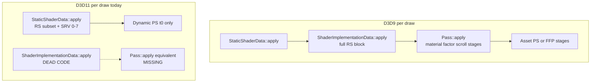

# Consult Responses — Iter-44 Pipeline Deep-Dive

**Date:** 2026-05-23 evening (post-Iter-44C wiring)
**Consult document:** [11-09.15-CODEX-CONSULT-iter44-pipeline-deepdive.md](11-09.15-CODEX-CONSULT-iter44-pipeline-deepdive.md)
**Reviewer:** Cursor (code-grounded)
**Confidence:** High on architecture / gap inventory; medium on ribbon-stretch root cause (symptom not re-smoked here)

---

## Executive summary

**Where we are conceptually:** Phase 11 reached its honest endpoint — *“opaque + diffuse-textured world via VS HLSL rewrite + dynamic slot-0 PS fallback + per-pass render-state subset.”* Iter-39C→44C closed the **state-only** bucket (blend enable/factors, depth, color-write, alpha-test, multi-SRV bind). What remains is **not another symptom iteration**; it is the **Pass::apply + asset PS** half of the D3D9 pipeline that was never ported.

**The structural blocker:** D3D9 `CreatePixelShader` consumes precompiled `.psh` PEXE bytecode that implements multi-texture compositing. D3D11 rejects that bytecode and substitutes a VS-signature-matched dynamic PS that declares only `t0`/`s0` and executes `tex0 * vertexColor` (+ optional `clip()`). Iter-44E proved bindings reach the GPU; **sampling/compositing does not.** Eyes, hammerhead, terrain detail, specular, and reflection are all in this bucket.

**Answer to the headline question (dynamic PS slot-0-only):** **Structural Phase 12 issue**, not an iter-fixable bug. A 44F “multi-modulate combiner” can shrink the symptom list but cannot reach true parity without a real per-asset PS path (offline recompile and/or PS HLSL rewrite mirroring the VS pipeline).

**Recommended Phase 11 close:** **PASS-WITH-DEFERRALS** per Plan 11-11 — diffuse world + UI baseline is real; name Phase 12 scope explicitly.

**Hindsight architectural decisions that look wrong now:**
1. Treating dynamic PS as a temporary bridge while deferring **Pass::apply constant upload** (material, textureFactor, textureScroll) — even a perfect PS cannot read constants never uploaded.
2. Assuming Iter-44A depth would fix eyes — depth wiring is correct, but `sul_eye.sht` / `sul_m_head.sht` failures are **texture-stage semantics in asset PS**, not Z-func.
3. Assuming “identity-W = broken transform” for ribbons — identity-W + world-space CPU verts is **intentional D3D9 behavior**; Iter-42v2 was never the fix for Swoosh/ParticleEmitter trails.
4. `setPixelShaderUserConstants_impl` writes a static `s_perMaterialShadow` but **never calls `updatePS(2, …)`** — dead write; bind-only flush leaves slot 2 at install zeros.

---

## Q1 — Comprehensive gap inventory

Ground truth: D3D9 per draw = `Direct3d9_StaticShaderData::apply(pass)` → `Direct3d9_ShaderImplementationData::apply(pass)` (full RS block) → `Pass::apply()` (material, textureFactor, scroll, stencil ref, fog color, per-stage texture bind, lighting flags). D3D11 = `Direct3d11_StaticShaderData::apply(passNumber)` only; `Direct3d11_ShaderImplementationData::apply` is confirmed dead code.

### Pipeline stage map

| Stage | D3D9 | D3D11 today | Class |
|-------|------|-------------|-------|
| **Plugin install / Gl_api** | Full | Mostly wired; fatal stubs remain | (a) partial |
| **Device / swap chain / present** | Full | `beginScene/endScene/present/clearViewport` wired; `resize`, `presentToWindow` stub | (a)+(b) |
| **Gamma / brightness / contrast** | `SetGammaRamp` | `setBrightnessContrastGamma_impl` no-op | (a) |
| **Per-frame transforms** | W, V, P, fog globals | WVP composition + row-scale (42v2) wired | (b) OK for mesh path |
| **Lighting** | Full LightData + dot3 + extended | Simplified `Direct3d11_LightManager` (ambient + 1 dir + 8 points; no dot3) | (b) |
| **Per-pass RS (ImplData block)** | ~17+ RS every pass | Subset in `StaticShaderData::apply`: blend, depth, color-write, alpha-test | (b) |
| **Per-pass RS missing** | stencil, shade, dither, A2C, FFP material-source | Not wired; DSS stencil frozen FALSE at install | (a) |
| **Pass::apply constants** | material, textureFactor×2, textureScroll, stencil ref, fog mode, fullAmbient | **Not implemented in D3D11 StaticShaderData at all** | (a) |
| **Texture bind (stages 0–7)** | `Stage::apply` per stage | Iter-44E SRV/sampler 0–7 + sticky unbind | (b) OK |
| **Texture transform / scroll** | D3DTSS + SetTransform(stage) | `setTextureTransform` no-op; scroll not uploaded | (a) |
| **VS** | D3D9 bytecode / HLSL | HLSL rewrite + dynamic compile (Plan 11-09.6+) | (b) OK for exercised paths |
| **PS** | Asset PEXE bytecode | Rejected; dynamic `t0*s0` fallback | (c) wrong semantics vs D3D9 |
| **Alpha test** | D3DRS + reference | PS `clip()` + cbuffer b1 (44B) | (b) enable+ref OK; **func not ported** |
| **Skeletal / VBVector** | Multi-stream + bone constants in VS file | VBVector bind wired (11-09.7); bone palette via VS constants in asset | (b) likely OK where VS rewrites |
| **Transformed verts (XYZRHW)** | Viewport c9 + 2D VS | Viewport c9 wired (11-09 Iter-2.7b); `drawQuadList` implemented (27) | (b) OK for UI smoke |
| **Draw dispatch** | All topologies | All wired incl. partial/indexed | (b) OK |
| **RT retarget / readback** | Full | `setRenderTarget` + `copyRenderTargetToNonRenderTargetTexture` wired | (b) OK |
| **Backbuffer lock / blit window** | Full | `lockBackBuffer/unlockBackBuffer/presentToWindow` fatal stub | (a) |
| **Point sprites / stars** | D3DRS point size | no-op (11-09.10); 1px POINTLIST | (d) acceptable deferral |
| **Bloom / cursor / IB opt / video buffers** | Full | fatal stub or dev-only stub | (a) or (d) |
| **Post-FX / compositing** | Real PS + RTs | RT path works; compositing PS = asset PS gap | (c) via PS bucket |
| **Screenshot** | — | Iter-41 wired | (b) OK |

Legend: **(a)** stubbed / missing, **(b)** partial, **(c)** implemented wrong semantics, **(d)** not exercised in Tatooine smoke.

### Symptom → gap mapping (post-Iter-44)

| Symptom | Primary gap(s) | Secondary |
|---------|----------------|-----------|
| Particle solid squares | 44C blend factors (TBD smoke); fallback PS `tex*color` only | Alpha test on some passes; no scroll |
| Head “clipped” / simplified | **PS multi-stage** (`sul_m_head.sht` 3 stages bound, 1 sampled) | — |
| Eyes through head + gray eyes | **PS multi-stage** (`sul_eye.sht`) | 44A depth irrelevant for dominant symptom |
| Ribbon / swoosh stretch | **Not Iter-42v2** — see Q3 | Blend/PS/scroll; possibly unrelated mesh trim |
| Sky cream washout | Gamma no-op | — |
| Building trim scale | Likely **mesh W+scale** or PS detail, not identity-W trail | — |
| Specular / normal / glow missing | Asset PS + material constants | LightManager simplification |
| Mini-map / char-select (fixed) | 44B alpha test | — |

### Fatal `scaffold_fatal_stub` slots still in `Direct3d11.cpp`

`resize`, `lockBackBuffer`, `unlockBackBuffer`, `presentToWindow`, `setMouseCursor`, `showMouseCursor`, `getOneToOneUVMapping`, `optimizeIndexBuffer`, `setBloomEnabled`, `writeImage`, dev video-buffer quartet. None block Tatooine outdoor smoke; launcher overlay / tooling paths hit them.

---

## Q2 — PS generation gap

### What D3D9 actually does (VSPS build)

For passes with a pixel shader program, D3D9 does **not** interpret `TextureOperation` at runtime — the **compiled `.psh`** implements compositing and reads `VSCR_material`, `PSCR_textureFactor`, scroll, and lighting constants uploaded in `Pass::apply()`. FFP `TextureOperation` cascade (`Direct3d9_ShaderImplementationData.cpp` Stage path) applies only to `#ifdef FFP` fixed-function passes.

D3D11 explicitly logs and rejects PEXE:

```748:754:src/engine/client/application/Direct3d11/src/win32/Direct3d11_PixelShaderProgramData.cpp
	// Current pre-compiled D3D9 bytecode case. We CANNOT pass this to
	// ID3D11Device::CreatePixelShader ...
```

Dynamic fallback:

```447:472:src/engine/client/application/Direct3d11/src/win32/Direct3d11_PixelShaderProgramData.cpp
		hlsl += "float4 main(PSIn input) : SV_TARGET\n{\n";
		// ...
			hlsl += "    float4 col = t.Sample(s, input.";
			// ... texField ... * input. ... colField ...
			hlsl += ";\n";
			hlsl += "    if (alphaTest.x > 0.5) clip(col.a - alphaTest.y);\n";
			hlsl += "    return col;\n";
```

Only `register(t0)` / `register(s0)` are declared (lines 407–408).

### Option evaluation

| Option | Verdict |
|--------|---------|
| **(a) Full TextureOperation × N stages** | **Wrong target** for VSPS dominant population; huge; duplicates work already in `.psh` assets. Only needed for rare FFP-only passes. |
| **(b) Modulate-everything heuristic** | **Interim 44F only** — helps simple multi-diffuse chains; **breaks** specular add, cube reflect, normal map, lerp detail masks. |
| **(c) Per-asset PS authoring / compile pipeline** | **Correct Phase 12 shape** — extend HlslRewrite to PS, or offline `.psh` → SM5 DXBC batch; bind real `ID3D11PixelShader` per program. |
| **(d) Format-heuristic skip spec/normal** | Fragile; still needs (c) for anything skipped wrong. |
| **(e) Dominant-case FFP subset** | Reasonable **bridge** alongside (c) for FFP-only draws; **not** sufficient for character/terrain VSPS shaders. |

### Recommended work shape (Phase 12)

1. **Primary:** Asset PS pipeline — same contract as VS (PEXE detect → rewrite or reject → cache by hash). This is the only path to eyes/head/terrain/specular parity.
2. **Parallel:** Port D3D9 `Pass::apply()` constant uploads to D3D11 (`material`, `textureFactor`, `textureScroll`, `setFullAmbientOn`, per-pass fog color) into `StaticShaderData::apply` **before** expecting any PS to look right.
3. **Optional bridge (44F):** Dynamic PS v2 — declare `t0..t7`, emit staged modulate/add from **StaticShaderTemplate stage metadata** where `.sht` exposes it, else modulate chain in bind order. Cap expectations: “better characters,” not parity.
4. **Stop:** Further state-only iters for multi-texture visuals — Iter-44E proved binding is not the bottleneck.

**Minimum extension for multi-stage shaders:** Not a few lines in `PixelShaderProgramData.cpp` — it requires **real PS bytecode or HLSL** plus **constant upload parity**. Slot-0-only is structural.

---

## Q3 — Transform paths bypassing `setObjectToWorldTransformAndScale`

Iter-42v2 fixed row-scale in the canonical setter (`Direct3d11_StateCache.cpp:1666–1702`, matching D3D9). Paths that **never call** it are not automatically broken — many set **identity W intentionally** because vertices are already in world space.

### Category A — Identity W + world-space verts (by design; WVP = P×V)

| Call site | File |
|-----------|------|
| ParticleEmitter (multiple draw paths) | `ParticleEmitter.cpp:864, 2903, 2935, 2965` |
| SwooshAppearance | `SwooshAppearance.cpp:806, 1192` |
| LightningAppearance | `LightningAppearance.cpp:535, 943` |
| DustAppearance, water, nebula, Bink, compositing, batch clear, etc. | grep hits under `clientParticle`, `clientTerrain`, `clientGame`, `ShaderPrimitiveSorter` |

**D3D11 handling:** Correct if P/V and VS multiply as D3D9 — **not an Iter-42v2 miss.**

### Category B — Camera O2W as W (billboard facing)

| Call site | File |
|-----------|------|
| SpriteAppearance | `SpriteAppearance.cpp:238` |
| MarkerAppearance | `MarkerAppearance.cpp:283` |

Uses `ShaderPrimitiveSorter::getCurrentCamera().getTransform_o2w()`.

### Category C — Owner / appearance W (normal object path, scale often `xyz111`)

| Call site | File |
|-----------|------|
| RibbonAppearance | `RibbonAppearance.cpp:203` |
| RibbonTrailAppearance | `RibbonTrailAppearance.cpp:289` |
| TrailAppearance | `TrailAppearance.cpp:209` |
| ShaderAppearance (+ scale) | `ShaderAppearance.cpp:106` |
| Extent/Grid/Beam/DynamicMesh/ShadowVolume/ViewerLight | respective `*Appearance.cpp` |

**Correction vs consult draft:** `RibbonAppearance` uses **owner transform**, not identity-W. Stretched mid-frame ribbons are **not** explained by “42v2 didn’t reach identity-W path” for ribbon.cpp itself; Swoosh/particle trails are the identity-W family.

### Category D — Normal mesh W + scale

Skeletal/static mesh draws via `ShaderAppearance`, attachment pipeline, terrain — **42v2 applies**.

### Category E — Pre-transformed XYZRHW (UI/HUD/radar)

`VertexBufferFormat::F_transformed`; drawn via `drawTriangleFan` / `drawQuadList`. D3D11: viewport `c9` upload in `setViewport` (StateCache ~1496–1513); transformed-vert diagnostics in fan path.

### Category F — Mixed ParticleEmitter

Some subpaths use `m_object->getTransform_o2w()` with scale (`ParticleEmitter.cpp:2888–2931`) — **does** go through row-scale setter.

### Handling verdict

| Category | D3D11 status |
|----------|--------------|
| A Identity-W world verts | **Correct transform model**; remaining bugs are RS/PS/blend |
| B Camera billboard | **Likely OK** if WVP math matches |
| C Owner W ribbons/trails | **Uses setter**; stretch → look at **strip topology, shader, scroll**, not missing setter |
| D Mesh W+scale | **Fixed** at 42v2 |
| E XYZRHW UI | **Wired** (viewport c9 + drawQuadList); radar alpha test fixed by 44B |
| F Mixed particles | Partially 42v2-relevant when o2w+scale used |

**Building trim:** Treat as **Category D or C** mesh/decorator draw, not Swoosh identity-W — investigate shader template + scale on that primitive, not a new transform iter.

---

## Q4 — Render-state architectural model

### What Iter-44A/B/C/E actually wired (in `StaticShaderData::apply`)

From `Direct3d11_StaticShaderData.cpp:619–703`:

- `setAlphaBlendEnable` (39C)
- `setAlphaTest` → PS cbuffer (44B)
- `setDepthEnable/Write/Compare` (44A)
- `setColorWriteEnable` (44A)
- `setAlphaBlendFactors` (44C)
- SRV/sampler 0–7 (44E)

### What D3D9 `ShaderImplementationData::apply` still pushes that D3D11 does not

From `Direct3d9_ShaderImplementationData.cpp:251–304` (VSPS path):

| State | D3D11 |
|-------|-------|
| Shade mode (Gouraud/flat) | ❌ not wired |
| Dither | ❌ |
| Stencil enable/func/ops/masks/two-sided | ❌ DSS stencil frozen off at install |
| Stencil reference (from Pass) | ❌ — D3D9 sets in `Pass::apply` via `D3DRS_STENCILREF` |
| Alpha test **function** (not just ref) | ❌ — 44B always `clip(a - ref)` |
| FFP material-source RS | ❌ N/A for VSPS |
| Per-pass fog **mode** → FOGCOLOR | ❌ — global `setFog` only |
| Alpha-to-coverage | ❌ hardcoded FALSE (`StateCache.cpp:697`) |

### State leakage risk

Hash-cache model is fine **if every pass mutates all diverging fields**. Current risk: **stencil + shade + fog color** can leak install defaults across passes. Lower risk for blend/depth after 44A–C because `StaticShaderData::apply` runs per draw.

### Is StateCache “complete enough”?

**For opaque world + UI baseline:** mostly yes after 44C smoke confirms particles.

**For true parity:** no — stencil decals, outline passes, some interior effects, and fog-mode overrides need the missing block plus Pass constant uploads.

---

## Q5 — Gamma / brightness / contrast

D3D9 (`Direct3d9.cpp:2198–2216`): builds 256-entry ramp, `SetGammaRamp`, also fills `ms_colorCorrectionTable` for CPU paths.

D3D11: intentional no-op (`Direct3d11.cpp:253–256`).

### D3D11 options (ranked)

1. **Full-screen LUT pass (recommended):** After main scene, before `present`, draw a triangle with a 1D/2D LUT texture encoding the same `pow(0.5 + contrast*(x*brightness - 0.5), 1/gamma)` curve. Matches D3D9 semantics on flip-discard swap chains; engine already has RT + blit infrastructure.
2. **Composite into swap chain with pixel shader on final blit:** Same math, hook at `Direct3d11_Device::present` or existing post-FX chain if always active.
3. **IDXGIOutput color space / HDR APIs:** Overkill for legacy SWG look; driver-dependent.
4. **Accept + document:** Reasonable for **Phase 11 PASS-WITH-DEFERRALS** (sky cream vs sunset); not acceptable for final Phase 12 parity claim.

**Do not** expect `SetGammaRamp` on DXGI flip-model — it is not the D3D11 equivalent.

---

## Phase 12 / Plan 11-11 scope recommendation

### Pursue for “true visual parity” (Phase 12 core)

1. **Asset PS pipeline** (DXBC SM5 per `.psh` or HLSL rewrite)
2. **Pass::apply constant parity** — material, textureFactor, textureScroll, stencil ref, fog mode, fullAmbient
3. **Extended lighting** — dot3 / extended light cbuffers to match D3D9 LightManager
4. **Stencil RS block**
5. **Gamma LUT pass**
6. **Point-sprite emulation** (stars, particle points) — Plan 11-11 already flagged
7. **Optional 44F combiner bridge** — only as accelerator, not substitute for (1)

### Acceptable Phase 11 known limitations (document in comparison-notes)

- Multi-texture character detail wrong (eyes, head, armor blends)
- Simplified lighting model
- Sky gamma drift
- 1px stars / point sprites
- Scattered magenta VS variants without TEXCOORD0
- Fatal stubs on tooling-only Gl_api slots

### Close Phase 11 as

**PASS-WITH-DEFERRALS** — outdoor diffuse-textured Tatooine + functional UI is the real milestone; Iter-44 closed the last cheap state-only wins.

---

## Architectural diagram (D3D9 vs D3D11 apply split)



---

## Synthesis — stop doing / start doing

| Stop | Start |
|------|-------|
| State-only iters for multi-texture symptoms | Phase 12 PS + Pass constant port |
| Assuming identity-W paths need row-scale | Debug those paths for PS/blend/scroll |
| Expecting 44A depth to fix eyes | Fix PS compositing for `sul_eye.sht` |
| Iterating dynamic PS shape alone | Wire `updatePS(2)` for material shadow + upload Pass constants |
| Binary PASS/REJECT for Phase 11 | PASS-WITH-DEFERRALS + named Phase 12 list |

---

## Evidence anchors (quick reference)

- D3D11 dead Impl apply: `Direct3d11_ShaderImplementationData.cpp:91–103`
- D3D11 StaticShader deferred comment: `Direct3d11_StaticShaderData.cpp:601–605`
- D3D9 Pass::apply material/scroll: `Direct3d9_StaticShaderData.cpp:835–953`
- D3D9 RS block: `Direct3d9_ShaderImplementationData.cpp:251–304`
- Dynamic PS slot 0 only: `Direct3d11_PixelShaderProgramData.cpp:407–472`
- PS PEXE rejection: `Direct3d11_PixelShaderProgramData.cpp:748–754`
- Row-scale fix: `Direct3d11_StateCache.cpp:1679–1702`
- Plan 11-11 PASS-WITH-DEFERRALS: `11-11-PLAN.md:66–70`
