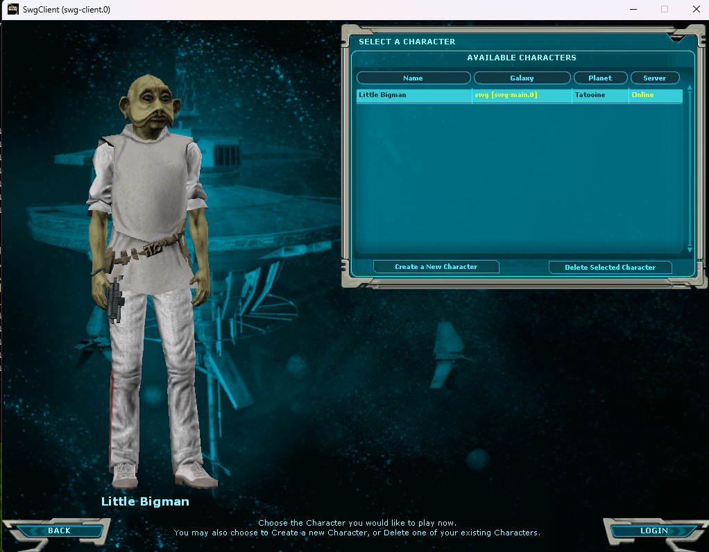
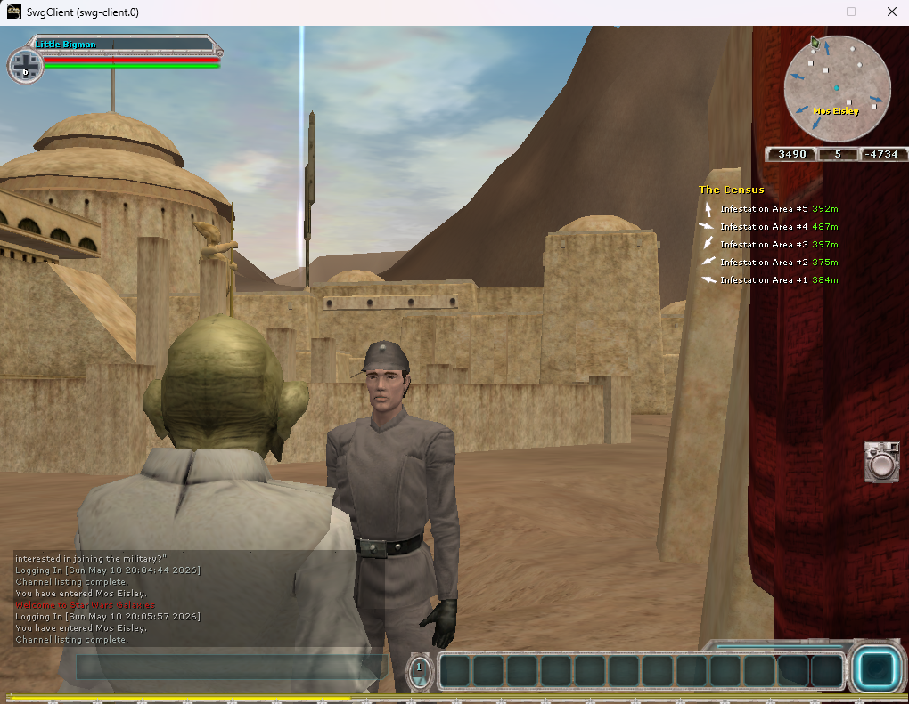
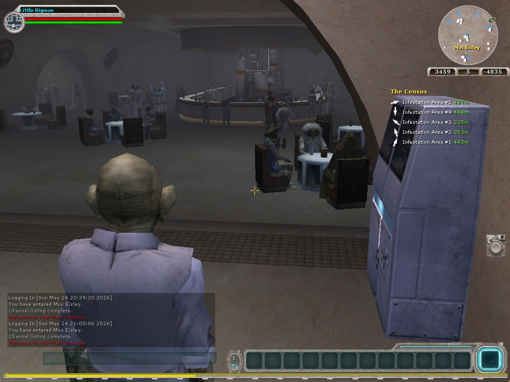
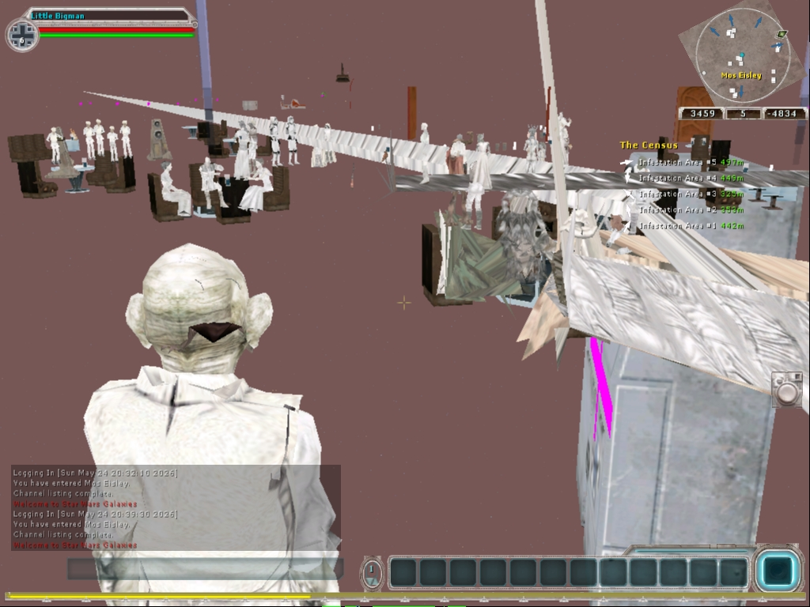
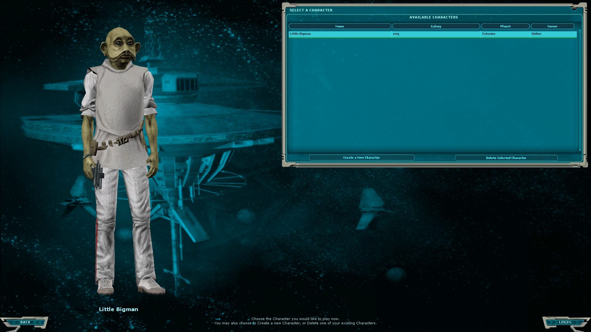
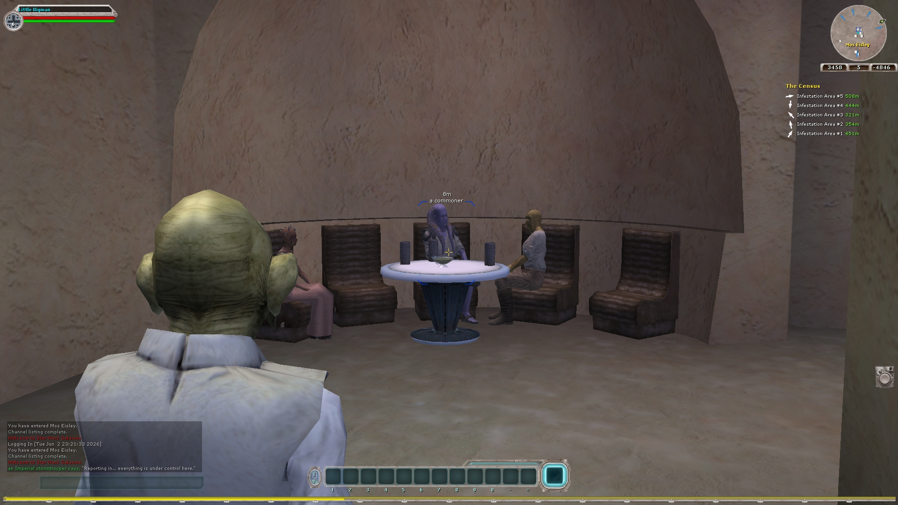
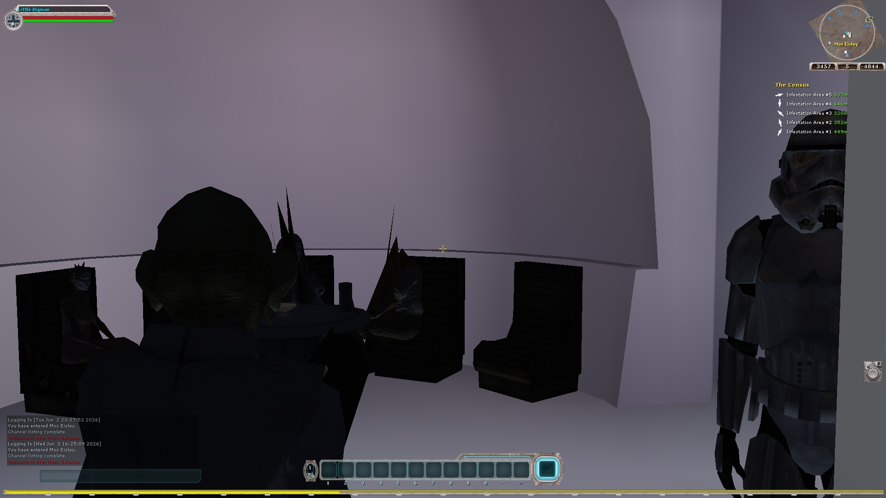
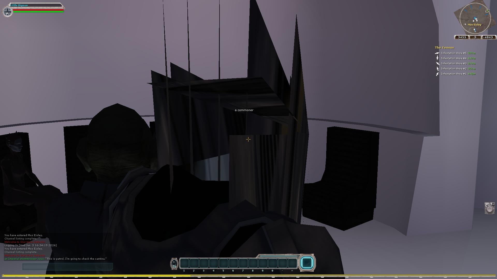
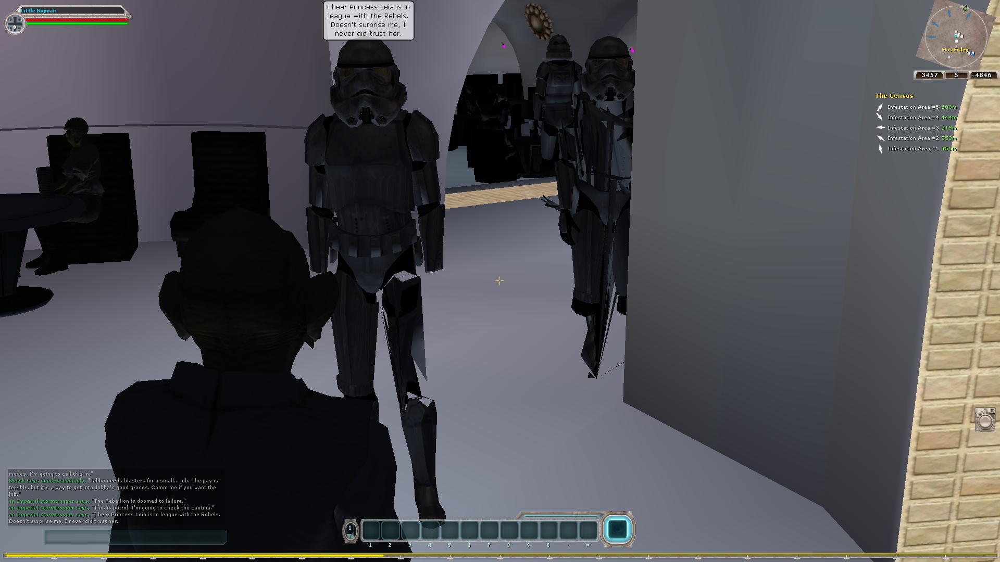
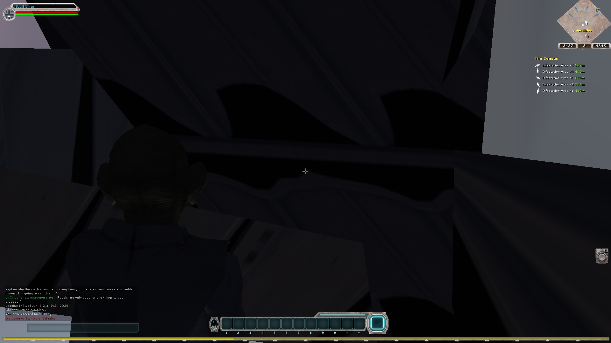

# SWG Client — D3D9 → D3D11 Renderer Port: Progress Gallery

A visual record of the in-house Direct3D 11 renderer plugin (`gl11`) being built up from
nothing to match the legacy Direct3D 9 reference (`gl05`), one milestone at a time.

> Remember the days of just staring at a half-magenta / half-black screen? 😄
> The magenta was the fallback pixel shader firing on geometry that *was* drawing correctly —
> we just couldn't shade it yet. Everything below is the climb out of that hole.

---

## 1. First light — geometry under MSVC/STL (Phase 09)

The client boots on the modern toolchain and renders real geometry: character select and
a Tatooine exterior. No correct shading yet, but the scene graph, meshes, and camera work.

| Character select | Tatooine |
|---|---|
|  |  |

## 2. D3D11 vs D3D9 baseline (Phase 12)

First honest side-by-side of the two renderers on the same spots — the gap analysis that
drove the rest of the work (lighting, gamma, texel seams).

| D3D9 reference (interior) | D3D11 (interior) |
|---|---|
|  |  |

## 3. Char-select visual parity via the asset pixel-shader lane (Phase 17)

The big one: real asset pixel shaders (PSRC recompile lane) driving the character, 9/9
binds, parity with the D3D9 reference. This is where D3D11 stopped being a toy.

| D3D9 reference | D3D11 (asset-PS lane) |
|---|---|
|  |  |

## 4. World + interiors: depth, lighting, //asm-VS fallback (Phase 19)

Whole-world depth buffering, per-vertex Gouraud lighting (tfcl/tfcsl reauthoring), and a
generic vertex-shader fallback so legacy `//asm` programs draw at all (`skippedNullVS`
38927 → 0). Interiors and sky finally render.

## 5. The cape/garment "black spikes" hunt (in progress — 2026-06-03)

A D3D11-only skinning regression: a few skinned-mesh vertices on robes/dresses/hands flung
to garbage positions. The screenshots below *are* the diagnostic — each one a deliberate
experiment that moved us toward the root cause.

**The bug vs the reference:**

| D3D9 — clean robe (target) | D3D11 — the spikes |
|---|---|
|  |  |

**The debugging arc:**

| Experiment | What it proved |
|---|---|
|  | Zeroing the dynamic-VB ring on discard sent the bad verts to **object origin (the feet/floor)** — proving they read *undefined ring memory*, not random corruption. |
|  | Forcing `WRITE_DISCARD` every lock largely killed the spikes but **dropped whole meshes** (stormtrooper hands) — proving the append model is *required*: meshes coexist at different ring offsets, drawn deferred. |
|  | The D3D9-faithful `ms_used` accounting fix took the per-frame ring **wraps from 370 → 0**, but unmasked a deeper deferred-draw/rename coupling (full-screen flicker). → CONSULT-20. |

**Root cause:** the D3D11 dynamic-VB ring charges `ms_used` by the *upper-bound locked*
length in `lock()`, while D3D9 charges the *actual used* count in `unlock()`. One UI lock
(`CuiLayerRenderer`, which locks the entire remaining ring) maxes `ms_used` → the shared ring
renames dozens of times per frame → deferred-draw skinned meshes read a stale rename → spikes.
Capture-invisible because RenderDoc serializes the CPU/GPU and the rename race vanishes.

---

*The arc: magenta fallback geometry → correct shading → world depth + lighting → character
parity → chasing the last skinning hazard. Months of incremental wins, captured frame by frame.*
